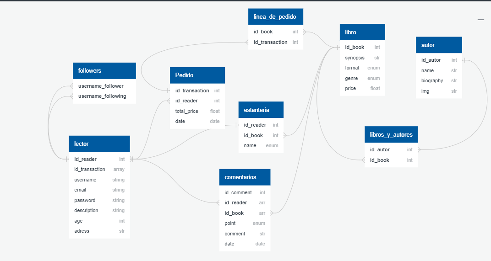

# <h1>Punto y Leído.</h1> 

Proyecto final junto a <a href="https://github.com/crduque">Cristina R. Duque</a>.

Da de alta tu perfil en la web para tener acceso a todo lo que ofrece

Tienda online y red social de libros para lectores. Guarda tus libros favoritos, o pendientes de leer, basa tus búsquedas en los gustos de las personas que sigues, y  comenta tu última lectura

Puedes buscar libros y autores, añade y compra los libros que necesites, o comprar por autor

<h2>Data base diagram</h2>

<h3> Mockups creados para móvil y ordenador en moqups.com:

<a href="https://app.moqups.com/Xu8kMCVdg3/edit/page/ad64222d5">Laptop Mockup</a>

<a href="https://app.moqups.com/AC1hnaCMIi/edit/page/ad64222d5">Mobile Mockup</a>

